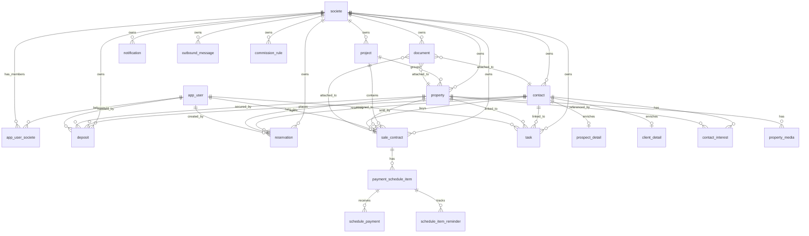

# Database Guide

PostgreSQL 16 · Liquibase · Hibernate 6

---

## 1. Schema Overview

- **Database**: PostgreSQL 16 (mandatory; RLS and advisory locks are used)
- **Schema management**: Liquibase owns all DDL — 52 changesets applied; next available: **053**
- **Hibernate**: `ddl-auto=validate` — Hibernate validates entity mappings against the schema but never modifies it
- **Tenant isolation**: Every domain table has `societe_id UUID NOT NULL` with a FK to `societe(id)`

The Liquibase changelog master is at:
`hlm-backend/src/main/resources/db/changelog/db.changelog-master.yaml`

---

## 2. Liquibase Rules (CRITICAL)

| Rule | Detail |
|---|---|
| Additive only | Never modify a changeset that has been deployed. Liquibase checksums changesets; a modification causes all migrations to fail at startup. |
| Next number | **053** |
| File naming | `NNN-description-kebab-case.yaml` |
| societe FK | Every new domain table must have `fk_<table>_societe` → `societe(id)` |
| Register | Add each new file to `db.changelog-master.yaml` in numeric order |

### Changeset Template

```yaml
databaseChangeLog:
  - changeSet:
      id: 053-my-new-feature
      author: dev
      changes:
        - createTable:
            tableName: my_feature
            columns:
              - column:
                  name: id
                  type: UUID
                  constraints:
                    primaryKey: true
                    nullable: false
              - column:
                  name: societe_id
                  type: UUID
                  constraints:
                    nullable: false
              - column:
                  name: created_at
                  type: TIMESTAMP
                  constraints:
                    nullable: false
              - column:
                  name: version
                  type: BIGINT
                  defaultValueNumeric: 0
                  constraints:
                    nullable: false
        - addForeignKeyConstraint:
            constraintName: fk_my_feature_societe
            baseTableName: my_feature
            baseColumnNames: societe_id
            referencedTableName: societe
            referencedColumnNames: id
```

---

## 3. Changeset History Table

| Range | Domain |
|---|---|
| 001–007 | Tenant/user bootstrap, contacts v1 |
| 008–015 | User roles, property, projects |
| 016–023 | Sale contracts, outbox, payments v1, media |
| 024–030 | Commission rules, portal tokens, reservations, lockout, GDPR, password fix |
| 031–035 | Multi-société: societe table, AppUserSociete, tenant→societe rename, migration, keys |
| 036–047 | User management: dedup email, indexes, version columns, extended fields, quotas, seed users, superadmin seed, rename tenant indexes |
| 048–049 | Task and document tables |
| 050 | RLS phase 1 (PostgreSQL Row-Level Security scaffolding) |
| 051 | RLS phase 2 — all 13 domain tables + nil-UUID system bypass |
| 052 | ShedLock table for distributed scheduler locking |

**Note on payment tables**: v1 payment tables (`payment_schedule`, `payment_call`, `payment`) were removed in the changeset 028 era. The active v2 tables are `payment_schedule_item`, `schedule_payment`, and `schedule_item_reminder`. Do not reference the v1 table names in new changesets or queries.

---

## 4. Entity Graph



---

## 5. Key Domain Entities — Quick Reference

| Entity | Table | Key Constraints | Notes |
|---|---|---|---|
| `AppUser` | `app_user` | `email` globally unique | `token_version` for JWT revocation; `@Version` for optimistic locking |
| `Societe` | `societe` | `key` globally unique | `max_utilisateurs` quota enforced; suspension fields exist but not enforced at request time |
| `AppUserSociete` | `app_user_societe` | PK `(user_id, societe_id)` | `role` stores `ADMIN`/`MANAGER`/`AGENT` — no `ROLE_` prefix; `actif` soft-removal |
| `Project` | `project` | `name` unique per societe | `status`: `ACTIVE`/`ARCHIVED`; archived projects not hard-deleted |
| `Property` | `property` | `reference_code` unique per societe | RLS enabled; soft delete via `deleted_at`; `@Version` |
| `Contact` | `contact` | `email` unique per societe | RLS enabled; GDPR consent fields; `anonymized_at`; `@Version` |
| `SaleContract` | `sale_contract` | Partial unique index: one active signed contract per property | Buyer snapshot fields at signing time; `@Version` |
| `Reservation` | `property_reservation` | Status: `ACTIVE`/`EXPIRED`/`CANCELLED`/`CONVERTED_TO_DEPOSIT` | Pessimistic write lock (`SELECT FOR UPDATE`) on create |
| `Deposit` | `deposit` | — | Blocked when ACTIVE reservation exists for property; property must be `ACTIVE` |
| `Task` | `task` | — | `assignee_id`, `societe_id` required; default list filtered by `assigneeId` |
| `Document` | `document` | — | Linked via `entity_type` + `entity_id` polymorphic reference |
| `PaymentScheduleItem` | `payment_schedule_item` | Sequence per contract | Denormalized `project_id`, `property_id` |
| `CommissionRule` | `commission_rule` | Optional `project_id` | Project rule overrides societe-wide default |
| `OutboundMessage` | `outbound_message` | — | Transactional outbox; exponential backoff `{1, 5, 30}` minutes |
| `Notification` | `notification` | — | In-app bell; `recipient_user_id`; `read` flag |
| `PortalToken` | `portal_token` | — | Only SHA-256 hash stored; one-time use; 48h TTL |

---

## 6. Row-Level Security (RLS)

RLS was introduced in two phases:
- Changeset 050: RLS scaffolding
- Changeset 051: All 13 domain tables + nil-UUID system bypass

### Tables with RLS Enabled

`contact`, `property`, `project`, `property_reservation`, `sale_contract`, `deposit`, `commission_rule`, `task`, `document`, `notification`, `property_media`, `payment_schedule_item`, `schedule_payment`, `schedule_item_reminder`

### Policy Logic

| Session variable `app.current_societe_id` | Rows visible |
|---|---|
| `00000000-0000-0000-0000-000000000000` (nil-UUID) | All rows — system/scheduler bypass |
| A real UUID | Only rows where `societe_id` matches |
| Unset (empty) | No rows |

### RLS Context Setting

`RlsContextAspect` intercepts all `@Service` and `@Repository` beans and calls `SET LOCAL app.current_societe_id = '<uuid>'` inside the current transaction before the query executes. It runs at `@Order(LOWEST_PRECEDENCE - 1)` to ensure it runs inside the transaction boundary.

The `OutboundDispatcherScheduler` and other system-context callers set the nil-UUID sentinel to bypass RLS when querying across all societes.

---

## 7. Useful Database Commands

### Connect via psql

```bash
# Local dev (Docker Compose)
psql -h localhost -p 5432 -U hlm -d hlmdb

# Inside Docker container
docker compose exec postgres psql -U hlm -d hlmdb
```

### Check Liquibase Status

```bash
cd hlm-backend && ./mvnw liquibase:status
```

### Check Applied Changesets

```sql
SELECT id, author, filename, dateexecuted
FROM databasechangelog
ORDER BY orderexecuted DESC
LIMIT 10;
```

### Check RLS Policies

```sql
SELECT tablename, policyname, cmd, qual
FROM pg_policies
WHERE schemaname = 'public'
ORDER BY tablename;
```

### Set RLS Context Manually (Debugging)

```sql
-- Set real societe context
SET app.current_societe_id = 'your-societe-uuid-here';
SELECT * FROM contact;

-- Set nil-UUID for system context (all rows)
SET app.current_societe_id = '00000000-0000-0000-0000-000000000000';
SELECT COUNT(*) FROM contact;
```

### Development Reset Sequence

```bash
# 1. Stop the stack
docker compose down -v

# 2. Restart (Liquibase runs all migrations from scratch)
docker compose up -d --wait --wait-timeout 180

# 3. Verify backend is healthy
docker compose ps
```

---

## 8. Common Database Pitfalls

### BCrypt seed data hash mismatch

BCrypt hashes in Liquibase seed changesets must match the documented seed password exactly. If a seed password is changed (e.g., `Admin123!` updated to `Admin123!Secure` in changeset 030), the BCrypt hash must be regenerated. Old hashes from previous versions cannot be used.

Seed credentials:
- `admin@acme.com` / `Admin123!Secure` (changeset 030)
- `superadmin@yourcompany.com` / `YourSecure2026!` (changeset 046)

### StrongPassword validator requirements

The `@StrongPassword` validator enforces: minimum 12 characters, at least one uppercase, one lowercase, one digit, one special character.

Regex: `^(?=.*[a-z])(?=.*[A-Z])(?=.*\d)(?=.*[^a-zA-Z\d]).{12,}$`

Compliant test passwords: `Admin123!Secure`, `TestPass123!`, `OldPass123!Sec`.

### PropertyType required fields

| Type | Required fields |
|---|---|
| `VILLA` | `surfaceAreaSqm`, `landAreaSqm`, `bedrooms`, `bathrooms` |
| `APPARTEMENT` | `surfaceAreaSqm`, `bedrooms`, `bathrooms`, `floorNumber` |

`APARTMENT` is not a valid enum value. Use `APPARTEMENT`.

### Changeset 035 key backfill

When running changeset 035 on existing installs, the key backfill must cover all societes that were migrated from the tenant table:

```sql
UPDATE societe s
SET key = t.key
FROM tenant t
WHERE s.id = t.id AND s.key IS NULL;
```

A partial update (e.g., only the default societe) leaves other societes without a key and causes 500 errors on login.

### AppUserSociete role CHECK constraint

The `chk_societe_role` constraint accepts only `ADMIN`, `MANAGER`, `AGENT`. Inserting `ROLE_ADMIN` or any other value causes a constraint violation (HTTP 500).

### JPQL with nullable LocalDateTime

PostgreSQL cannot infer the type of a null bind parameter in standard JPQL null checks. Use `CAST`:

```java
// Correct
"AND (CAST(:param AS LocalDateTime) IS NULL OR t.dueDate < :param)"

// Wrong — PostgreSQL type inference error
"AND (:param IS NULL OR t.dueDate < :param)"
```
