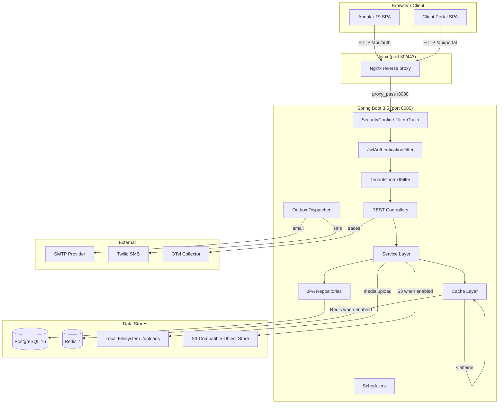
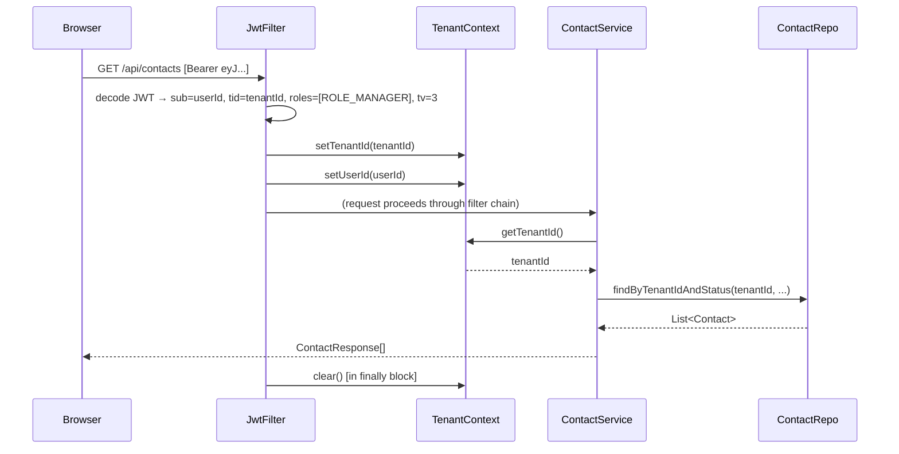
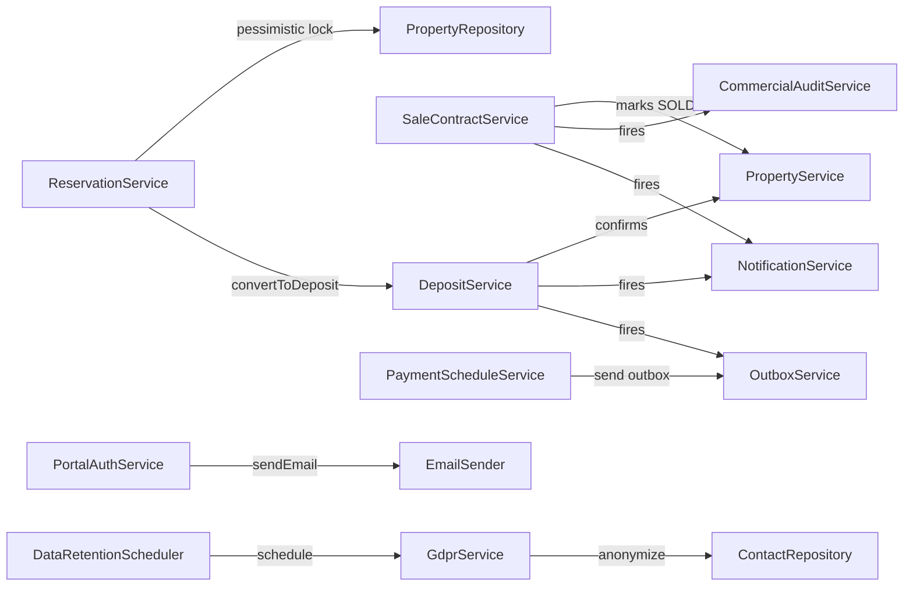

# Architecture Overview

The YEM SaaS Platform is a multi-tenant real-estate CRM composed of a Spring Boot 3.5 backend, an Angular 19 single-page frontend, a PostgreSQL database, a Redis cache, and an optional S3-compatible object store. Every layer enforces tenant isolation using the JWT `tid` claim propagated through a ThreadLocal `TenantContext`.

## Table of Contents

1. [Component Diagram](#component-diagram)
2. [Request Lifecycle](#request-lifecycle)
3. [Multi-Tenancy Flow](#multi-tenancy-flow)
4. [Backend Package Structure](#backend-package-structure)
5. [Frontend Structure](#frontend-structure)
6. [Service Interactions](#service-interactions)
7. [Async and Scheduled Work](#async-and-scheduled-work)
8. [Infrastructure](#infrastructure)

---

## Component Diagram



---

## Request Lifecycle

A typical authenticated API request flows as follows:

1. **Browser** sends `GET /api/contacts` with `Authorization: Bearer <jwt>`.
2. **Nginx** (in production) terminates TLS and proxies to `http://hlm-backend:8080`. It sets `X-Forwarded-Proto: https` when `FORWARD_HEADERS_STRATEGY=FRAMEWORK`.
3. **Spring Boot** receives the request. The `SecurityFilterChain` (defined in `SecurityConfig`) runs filters in order.
4. **`RequestCorrelationFilter`** generates a `correlationId` UUID and puts it on the MDC for structured logging.
5. **`JwtAuthenticationFilter`** reads `Authorization: Bearer <token>`, validates it via `JwtProvider`, extracts `sub` (userId), `tid` (tenantId), `roles`, and `tv` (tokenVersion). For non-portal tokens it checks `UserSecurityCacheService` to detect revoked tokens (disabled accounts, role changes). It populates `TenantContext.setTenantId()` and `TenantContext.setUserId()`.
6. Spring Security's `authorizeHttpRequests` rules evaluate the role. `/api/**` requires `ADMIN`, `MANAGER`, or `AGENT`. Portal endpoints `/api/portal/**` require `ROLE_PORTAL`.
7. The request reaches the **controller** (e.g., `ContactController`). Controllers are thin — they delegate immediately to the **service**.
8. **Service** calls `TenantContext.getTenantId()` to scope all DB operations. JPA queries always include `WHERE tenant_id = :tenantId`.
9. **Repository** (Spring Data JPA) queries PostgreSQL. Hibernate 6 validates the schema on startup (`ddl-auto: validate`).
10. The response is serialized to JSON. Errors go through `GlobalExceptionHandler` which returns `ErrorResponse` with an `ErrorCode` enum value.
11. In the `finally` block of `JwtAuthenticationFilter`, `TenantContext.clear()` removes the ThreadLocals to prevent cross-request leakage.

---

## Multi-Tenancy Flow



The key rule: **no service method trusts a tenantId from the request body or path parameter**. Tenant identity always comes from `TenantContext`, which is populated exclusively from the validated JWT `tid` claim.

---

## Backend Package Structure

All backend code lives under `com.yem.hlm.backend`. The top-level packages are domain-aligned:

| Package | Purpose |
|---------|---------|
| `auth` | JWT generation/validation, Spring Security config, login, password, lockout, rate limiting |
| `tenant` | Tenant entity, TenantContext ThreadLocal, tenant bootstrap endpoint |
| `user` | CRM user management (ADMIN only) — create, enable/disable, change role, reset password |
| `project` | Real-estate project catalog (buildings, developments) |
| `property` | Property catalog — 9 types, soft delete, CSV import, media, dashboard KPIs |
| `contact` | Prospect and client contacts, interests, status lifecycle, timeline |
| `deposit` | Booking deposit workflow — PENDING → CONFIRMED → CANCELLED, PDF |
| `reservation` | Short-term property hold — ACTIVE → EXPIRED/CANCELLED/CONVERTED_TO_DEPOSIT |
| `contract` | Sale contract lifecycle — DRAFT → SIGNED / CANCELLED, PDF |
| `dashboard` | Commercial KPI dashboard, receivables dashboard, cash dashboard |
| `audit` | Immutable commercial audit event log |
| `notification` | In-app notification inbox (CRM bell notifications) |
| `outbox` | Transactional outbox for EMAIL/SMS dispatch |
| `commission` | Commission rules per tenant/project, per-agent commission queries |
| `payments` | Payment schedule items (appels de fonds), partial payment recording |
| `portal` | Client-facing portal — magic link auth, ROLE_PORTAL, contract/payment views |
| `media` | Property photo/PDF upload — local filesystem or S3-compatible |
| `reminder` | Daily deposit due-date warnings and stale prospect notifications |
| `gdpr` | GDPR / Law 09-08 — data export, anonymization, rectification, privacy notice |
| `common` | Cross-cutting: error envelope, validation annotations, rate limiter, correlation filter |

Within each domain package the sub-package layout is:
- `domain/` — JPA entities and enums
- `repo/` — Spring Data JPA repositories
- `service/` — business logic, exceptions
- `api/` — REST controllers
- `api/dto/` — request/response records

---

## Frontend Structure

The Angular 19 SPA (`hlm-frontend/src/app/`) uses standalone components and lazy-loaded routes:

```
app/
  core/
    auth/          auth.service, auth.guard, admin.guard, auth.interceptor
    services/      api services (contacts, properties, projects, ...)
  features/
    login/
    shell/         main app layout, sidebar nav
    properties/    property list + detail
    contacts/      contact list + detail
    prospects/
    projects/
    contracts/     contract list + detail + payment-schedule
    reservations/
    dashboard/     commercial + sales + cash + receivables
    commissions/
    audit/
    notifications/
    outbox/
    admin-users/   (adminGuard-protected)
  portal/
    core/          portal-auth.service, portal.guard, portal.interceptor
    features/
      portal-login/
      portal-shell/
      portal-contracts/
      portal-payments/
      portal-property/
  shared/          shared components and pipes
```

The dev proxy (`proxy.conf.json`) forwards `/auth`, `/api`, `/dashboard`, and `/actuator` to `http://localhost:8080`, so the Angular dev server runs on port 4200 and never makes direct cross-origin requests.

Two HTTP interceptors are registered in `app.config.ts`:
- `authInterceptor` — attaches the CRM JWT from localStorage key `hlm_token` to all `/api` and `/auth` calls.
- `portalInterceptor` — attaches the portal JWT from localStorage key `hlm_portal_token` to all `/api/portal/` calls.

---

## Service Interactions



---

## Async and Scheduled Work

| Component | Trigger | What it does |
|-----------|---------|--------------|
| `OutboundDispatcherService` | Fixed-delay 5 s (configurable `OUTBOX_POLL_INTERVAL_MS`) | Claims PENDING outbox messages using `FOR UPDATE SKIP LOCKED`, sends EMAIL or SMS, updates status |
| `DepositWorkflowScheduler` | Daily cron (configurable) | Marks PENDING deposits past due-date as expired/overdue |
| `ReservationExpiryScheduler` | Hourly cron `0 0 * * * *` | Marks ACTIVE reservations past expiry_date as EXPIRED |
| `DataRetentionScheduler` | Daily at 02:00 (`DATA_RETENTION_CRON`) | GDPR retention sweep — anonymizes contacts past their retention period |
| `payments/ReminderService` scheduler | Daily at 08:00 (`REMINDER_CRON`) | Payment schedule reminders (OVERDUE notifications, pre-due warnings) |
| `PortalTokenCleanupScheduler` | Daily at 03:00 (`PORTAL_CLEANUP_CRON`) | Deletes expired/used portal tokens |
| `PaymentsOverdueScheduler` | Daily at 06:00 (`PAYMENTS_OVERDUE_CRON`) | Marks payment schedule items past due-date as OVERDUE |

All schedulers are guarded by `@ConditionalOnProperty("spring.task.scheduling.enabled", matchIfMissing=true)` so they can be disabled in test profiles via `SPRING_TASK_SCHEDULING_ENABLED=false`.

---

## Infrastructure

See [guides/engineer/docker.md](../guides/engineer/docker.md) for detailed compose stack documentation.

The base `docker-compose.yml` defines five services:

| Service | Image | Port | Purpose |
|---------|-------|------|---------|
| `postgres` | `postgres:16-alpine` | 5432 | Primary database |
| `redis` | `redis:7-alpine` | 6379 | Distributed cache (when `REDIS_ENABLED=true`) |
| `minio` | `minio/minio:latest` | 9000/9001 | S3-compatible object storage for media |
| `hlm-backend` | Built from `hlm-backend/Dockerfile` | 8080 | Spring Boot application |
| `hlm-frontend` | Built from `hlm-frontend/Dockerfile` | 80 | Nginx-served Angular SPA |
