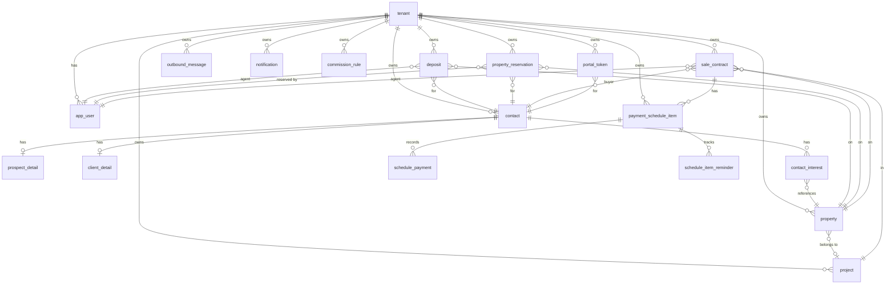

# Data Model

This document describes every database table in the YEM SaaS Platform schema, derived from the 30 Liquibase changesets in `hlm-backend/src/main/resources/db/changelog/changes/`. The schema uses PostgreSQL 16. All tables follow the multi-tenancy rule: every business entity includes a `tenant_id` column with a foreign key to the `tenant` table.

## Table of Contents

1. [ER Diagram](#er-diagram)
2. [Tables](#tables)
   - [tenant](#tenant)
   - [app_user](#app_user)
   - [contact](#contact)
   - [prospect_detail](#prospect_detail)
   - [client_detail](#client_detail)
   - [contact_interest](#contact_interest)
   - [property](#property)
   - [project](#project)
   - [deposit](#deposit)
   - [property_reservation](#property_reservation)
   - [sale_contract](#sale_contract)
   - [payment_schedule_item](#payment_schedule_item)
   - [schedule_payment](#schedule_payment)
   - [schedule_item_reminder](#schedule_item_reminder)
   - [outbound_message](#outbound_message)
   - [notification](#notification)
   - [commercial_audit_event](#commercial_audit_event)
   - [property_media](#property_media)
   - [commission_rule](#commission_rule)
   - [portal_token](#portal_token)
3. [Dropped Tables](#dropped-tables)
4. [Index Summary](#index-summary)

---

## ER Diagram

---

## Tables

### tenant

Created in changeset `001-init-tenant-user`.

| Column | Type | Nullable | Default | Notes |
|--------|------|----------|---------|-------|
| `id` | `uuid` | NOT NULL | — | Primary key |
| `key` | `varchar(80)` | NOT NULL | — | Unique short identifier (e.g. `acme`) |
| `name` | `varchar(160)` | NOT NULL | — | Display name |

**Constraints:** `uk_tenant_key` unique on `key`.

---

### app_user

Created in changeset `001-init-tenant-user`, extended in `008-add-user-roles`, `011-add-user-token-version`, `027-add-login-lockout-fields`.

| Column | Type | Nullable | Default | Notes |
|--------|------|----------|---------|-------|
| `id` | `uuid` | NOT NULL | — | Primary key |
| `tenant_id` | `uuid` | NOT NULL | — | FK → `tenant.id` ON DELETE RESTRICT |
| `email` | `varchar(190)` | NOT NULL | — | Unique per tenant |
| `password_hash` | `varchar(255)` | NOT NULL | — | BCrypt-hashed |
| `enabled` | `boolean` | NOT NULL | `true` | Disabled users cannot log in |
| `role` | `varchar(32)` | NOT NULL | `ROLE_AGENT` | One of `ROLE_ADMIN`, `ROLE_MANAGER`, `ROLE_AGENT` |
| `token_version` | `int` | NOT NULL | `0` | Incremented on role change or disable; used for token revocation |
| `failed_login_attempts` | `int` | NOT NULL | `0` | Brute-force counter |
| `locked_until` | `timestamp` | NULL | — | Account locked until this timestamp |

**Constraints:** `uk_user_tenant_email` unique on `(tenant_id, email)`.

---

### contact

Created in changesets `003-create-contact-tables`, `004-contact-v2-and-interests`, `005-relational-contact-details-deposit-notification`, `029-add-consent-fields`.

| Column | Type | Nullable | Default | Notes |
|--------|------|----------|---------|-------|
| `id` | `uuid` | NOT NULL | — | Primary key |
| `tenant_id` | `uuid` | NOT NULL | — | FK → `tenant.id` |
| `contact_type` | `varchar(32)` | NOT NULL | — | `PROSPECT`, `CLIENT`, `BOTH` |
| `status` | `varchar(32)` | NOT NULL | — | `NEW`, `CONTACTED`, `QUALIFIED_PROSPECT`, `ACTIVE_CLIENT`, `INACTIVE`, `LOST` |
| `full_name` | `varchar(300)` | NOT NULL | — | Derived from first_name + last_name or provided directly |
| `first_name` | `varchar(100)` | NULL | — | |
| `last_name` | `varchar(100)` | NULL | — | |
| `email` | `varchar(190)` | NULL | — | Unique per tenant when set |
| `phone` | `varchar(30)` | NULL | — | |
| `qualified` | `boolean` | NOT NULL | `false` | True when promoted to QUALIFIED_PROSPECT |
| `temp_client_until` | `timestamp` | NULL | — | Temporary client status expiry |
| `created_by` | `uuid` | NULL | — | User UUID |
| `updated_by` | `uuid` | NULL | — | User UUID |
| `lost_reason` | `varchar(255)` | NULL | — | |
| `created_at` | `timestamp` | NOT NULL | — | |
| `updated_at` | `timestamp` | NOT NULL | — | |
| `consent_given` | `boolean` | NOT NULL | `false` | GDPR consent flag |
| `consent_date` | `timestamp` | NULL | — | When consent was recorded |
| `consent_method` | `varchar(100)` | NULL | — | e.g. `FORM`, `VERBAL`, `EMAIL` |
| `processing_basis` | `varchar(100)` | NULL | — | e.g. `CONSENT`, `CONTRACT`, `LEGITIMATE_INTEREST` |
| `data_retention_days` | `int` | NULL | — | Override for tenant default (1825 days = 5 years) |
| `anonymized_at` | `timestamp` | NULL | — | Set when GDPR erasure anonymizes this contact |

---

### prospect_detail

Created in changeset `005-relational-contact-details-deposit-notification`. One-to-one with `contact` (ON DELETE CASCADE).

| Column | Type | Nullable | Notes |
|--------|------|----------|-------|
| `contact_id` | `uuid` | NOT NULL (PK, FK) | |
| `budget_min` | `numeric(19,2)` | NULL | |
| `budget_max` | `numeric(19,2)` | NULL | |
| `source` | `varchar(80)` | NULL | Lead source (e.g. `WEB`, `REFERRAL`) |
| `notes` | `varchar(1000)` | NULL | |
| `created_at` | `timestamp` | NOT NULL | |
| `updated_at` | `timestamp` | NOT NULL | |

---

### client_detail

Created in changeset `005-relational-contact-details-deposit-notification`. One-to-one with `contact` (ON DELETE CASCADE).

| Column | Type | Nullable | Notes |
|--------|------|----------|-------|
| `contact_id` | `uuid` | NOT NULL (PK, FK) | |
| `client_kind` | `varchar(32)` | NULL | `INDIVIDUAL` or `COMPANY` |
| `company_name` | `varchar(180)` | NULL | |
| `ice` | `varchar(32)` | NULL | Moroccan company tax ID |
| `siret` | `varchar(32)` | NULL | French company ID |
| `created_at` | `timestamp` | NOT NULL | |
| `updated_at` | `timestamp` | NOT NULL | |

---

### contact_interest

Created in changeset `004-contact-v2-and-interests`.

| Column | Type | Nullable | Notes |
|--------|------|----------|-------|
| `id` | `uuid` | NOT NULL (PK) | |
| `contact_id` | `uuid` | NOT NULL (FK → contact.id) | |
| `property_id` | `uuid` | NOT NULL (FK → property.id) | |
| `status` | `varchar(32)` | NOT NULL | `INTERESTED`, `VISITED`, `OFFERED`, `REJECTED` |
| `notes` | `varchar(500)` | NULL | |
| `created_at` | `timestamp` | NOT NULL | |

**Constraints:** unique on `(contact_id, property_id)`.

---

### property

Created in changeset `009-create-property-table`, extended in `012-property-listed-for-sale-project-building`, `014-property-add-project-fk`, `015-property-add-reserved-at`.

| Column | Type | Nullable | Notes |
|--------|------|----------|-------|
| `id` | `uuid` | NOT NULL (PK) | |
| `tenant_id` | `uuid` | NOT NULL (FK → tenant.id) | |
| `type` | `varchar(20)` | NOT NULL | `VILLA`, `APPARTEMENT`, `DUPLEX`, `STUDIO`, `T2`, `T3`, `COMMERCE`, `LOT`, `TERRAIN_VIERGE` |
| `status` | `varchar(20)` | NOT NULL | `ACTIVE`, `RESERVED`, `SOLD`, `DELETED` |
| `reference_code` | `varchar(50)` | NOT NULL | Unique per tenant |
| `title` | `varchar(200)` | NOT NULL | |
| `description` | `text` | NULL | |
| `notes` | `text` | NULL | |
| `price` | `decimal(15,2)` | NULL | |
| `currency` | `varchar(3)` | NOT NULL | `MAD` default |
| `commission_rate` | `decimal(5,2)` | NULL | |
| `estimated_value` | `decimal(15,2)` | NULL | |
| `address` | `varchar(500)` | NULL | |
| `city` | `varchar(100)` | NULL | |
| `region` | `varchar(100)` | NULL | |
| `postal_code` | `varchar(20)` | NULL | |
| `latitude` | `decimal(10,7)` | NULL | |
| `longitude` | `decimal(10,7)` | NULL | |
| `title_deed_number` | `varchar(100)` | NULL | |
| `cadastral_reference` | `varchar(100)` | NULL | |
| `owner_name` | `varchar(200)` | NULL | |
| `legal_status` | `varchar(50)` | NULL | |
| `surface_area_sqm` | `decimal(10,2)` | NULL | Required for VILLA, APPARTEMENT, DUPLEX, STUDIO, T2, T3, COMMERCE |
| `land_area_sqm` | `decimal(10,2)` | NULL | Required for VILLA, LOT, TERRAIN_VIERGE |
| `bedrooms` | `int` | NULL | Required for VILLA, APPARTEMENT, DUPLEX, T2, T3 |
| `bathrooms` | `int` | NULL | Required for VILLA, APPARTEMENT, DUPLEX, T2, T3 |
| `floors` | `int` | NULL | Required for DUPLEX |
| `parking_spaces` | `int` | NULL | |
| `has_garden` | `boolean` | NULL | |
| `has_pool` | `boolean` | NULL | |
| `building_year` | `int` | NULL | |
| `floor_number` | `int` | NULL | Required for APPARTEMENT, STUDIO, T2, T3 |
| `zoning` | `varchar(50)` | NULL | Required for LOT |
| `is_serviced` | `boolean` | NULL | Required for LOT |
| `project_id` | `uuid` | NULL (FK → project.id) | |
| `listed_for_sale` | `boolean` | NULL | |
| `building` | `varchar(200)` | NULL | Building name within a project |
| `reserved_at` | `timestamp` | NULL | Set when property becomes RESERVED |
| `created_by` | `uuid` | NULL | |
| `updated_by` | `uuid` | NULL | |
| `created_at` | `timestamp` | NOT NULL | |
| `updated_at` | `timestamp` | NOT NULL | |
| `deleted_at` | `timestamp` | NULL | Set on soft delete |
| `published_at` | `timestamp` | NULL | |
| `sold_at` | `timestamp` | NULL | Set when property becomes SOLD |

**Key indexes:** `idx_property_tenant_status`, `idx_property_tenant_type_status`, `idx_property_tenant_city_region`, `idx_property_tenant_price`, `idx_property_tenant_created_at`.
**Unique constraint:** `uk_property_tenant_reference` on `(tenant_id, reference_code)`.

---

### project

Created in changeset `013-create-project-table`.

| Column | Type | Nullable | Notes |
|--------|------|----------|-------|
| `id` | `uuid` | NOT NULL (PK) | |
| `tenant_id` | `uuid` | NOT NULL (FK → tenant.id) | |
| `name` | `varchar(200)` | NOT NULL | Unique per tenant |
| `description` | `text` | NULL | |
| `status` | `varchar(20)` | NOT NULL | `ACTIVE`, `ARCHIVED` |
| `city` | `varchar(100)` | NULL | |
| `region` | `varchar(100)` | NULL | |
| `created_at` | `timestamp` | NOT NULL | |
| `updated_at` | `timestamp` | NOT NULL | |

**Unique constraint:** `uk_project_tenant_name` on `(tenant_id, name)`.

---

### deposit

Created in changesets `003-create-contact-tables` (initial, minimal), `005-relational-contact-details-deposit-notification` (extended with tenant/agent/property/dates), `006-deposit-uniques-and-notification-dedupe`, `007-deposit-currency-not-null`.

| Column | Type | Nullable | Notes |
|--------|------|----------|-------|
| `id` | `uuid` | NOT NULL (PK) | |
| `tenant_id` | `uuid` | NOT NULL (FK → tenant.id ON DELETE CASCADE) | |
| `contact_id` | `uuid` | NOT NULL (FK → contact.id) | |
| `property_id` | `uuid` | NOT NULL (FK → property.id) | |
| `agent_id` | `uuid` | NOT NULL (FK → app_user.id) | |
| `reference` | `varchar(50)` | NOT NULL | Auto-generated e.g. `DEP-2024-001` |
| `amount` | `decimal(15,2)` | NOT NULL | |
| `currency` | `varchar(3)` | NOT NULL | `MAD` default |
| `status` | `varchar(20)` | NOT NULL | `PENDING`, `CONFIRMED`, `CANCELLED`, `CONVERTED` |
| `due_date` | `timestamp` | NULL | |
| `confirmed_at` | `timestamp` | NULL | |
| `cancelled_at` | `timestamp` | NULL | |
| `created_at` | `timestamp` | NOT NULL | |
| `updated_at` | `timestamp` | NOT NULL | |

**Unique constraint:** `uk_deposit_tenant_property` on `(tenant_id, property_id)` where `status` is not `CANCELLED` (service-level enforcement).
**Key indexes:** `idx_deposit_tenant_status`, `idx_deposit_tenant_contact`, `idx_deposit_tenant_property`, `idx_deposit_tenant_agent`.

---

### property_reservation

Created in changeset `026-create-property-reservation`.

| Column | Type | Nullable | Notes |
|--------|------|----------|-------|
| `id` | `uuid` | NOT NULL (PK) | |
| `tenant_id` | `uuid` | NOT NULL (FK → tenant.id) | |
| `contact_id` | `uuid` | NOT NULL (FK → contact.id) | |
| `property_id` | `uuid` | NOT NULL (FK → property.id) | |
| `reserved_by_user_id` | `uuid` | NOT NULL (FK → app_user.id) | |
| `reservation_price` | `decimal(12,2)` | NULL | |
| `reservation_date` | `date` | NOT NULL | |
| `expiry_date` | `timestamp` | NOT NULL | Default +7 days |
| `status` | `varchar(30)` | NOT NULL | `ACTIVE`, `EXPIRED`, `CANCELLED`, `CONVERTED_TO_DEPOSIT` |
| `notes` | `text` | NULL | |
| `converted_deposit_id` | `uuid` | NULL | Set when converted to a deposit |
| `created_at` | `timestamp` | NOT NULL | |
| `updated_at` | `timestamp` | NOT NULL | |

**Key indexes:** `idx_preser_tenant_status`, `idx_preser_tenant_property`, `idx_preser_tenant_contact`, `idx_preser_expiry_date`.

---

### sale_contract

Created in changeset `016-create-sale-contract`, extended in `018-add-buyer-snapshot-to-sale-contract`.

| Column | Type | Nullable | Notes |
|--------|------|----------|-------|
| `id` | `uuid` | NOT NULL (PK) | |
| `tenant_id` | `uuid` | NOT NULL (FK → tenant.id) | |
| `project_id` | `uuid` | NOT NULL (FK → project.id) | |
| `property_id` | `uuid` | NOT NULL (FK → property.id) | |
| `buyer_contact_id` | `uuid` | NOT NULL (FK → contact.id) | |
| `agent_id` | `uuid` | NOT NULL (FK → app_user.id) | |
| `status` | `varchar(20)` | NOT NULL | `DRAFT`, `SIGNED`, `CANCELLED` |
| `agreed_price` | `decimal(15,2)` | NOT NULL | |
| `list_price` | `decimal(15,2)` | NULL | For discount analytics |
| `source_deposit_id` | `uuid` | NULL | Optional link to originating deposit |
| `buyer_full_name` | `varchar(300)` | NULL | Snapshot at signing |
| `buyer_cin` | `varchar(50)` | NULL | National ID snapshot |
| `buyer_address` | `varchar(500)` | NULL | Snapshot |
| `created_at` | `timestamp` | NOT NULL | |
| `updated_at` | `timestamp` | NOT NULL | |
| `signed_at` | `timestamp` | NULL | Set when signed |
| `canceled_at` | `timestamp` | NULL | Set when cancelled |

**Partial unique index:** `uk_sc_property_signed` on `(tenant_id, property_id)` WHERE `status = 'SIGNED' AND canceled_at IS NULL` — ensures only one active signed contract per property.
**Key indexes:** `idx_sc_tenant_signed_at`, `idx_sc_tenant_project_signed_at`, `idx_sc_tenant_agent_signed_at`, `idx_sc_tenant_property`.

---

### payment_schedule_item

Created in changeset `020-create-payment-schedule`.

| Column | Type | Nullable | Notes |
|--------|------|----------|-------|
| `id` | `uuid` | NOT NULL (PK) | |
| `tenant_id` | `uuid` | NOT NULL (FK → tenant.id ON DELETE CASCADE) | |
| `contract_id` | `uuid` | NOT NULL (FK → sale_contract.id ON DELETE CASCADE) | |
| `project_id` | `uuid` | NOT NULL | Denormalized for query efficiency |
| `property_id` | `uuid` | NOT NULL | Denormalized |
| `sequence` | `int` | NOT NULL | Order within the schedule |
| `label` | `varchar(200)` | NOT NULL | e.g. "Dépôt de garantie" |
| `amount` | `decimal(19,2)` | NOT NULL | |
| `due_date` | `date` | NOT NULL | |
| `status` | `varchar(20)` | NOT NULL | `DRAFT`, `ISSUED`, `SENT`, `OVERDUE`, `PAID`, `CANCELED` |
| `issued_at` | `timestamp` | NULL | |
| `sent_at` | `timestamp` | NULL | |
| `canceled_at` | `timestamp` | NULL | |
| `notes` | `text` | NULL | |
| `created_at` | `timestamp` | NOT NULL | |
| `created_by` | `uuid` | NOT NULL | |
| `updated_at` | `timestamp` | NOT NULL | |

**Key indexes:** `idx_psi_tenant_contract`, `idx_psi_tenant_project_due`, `idx_psi_tenant_due_status`.

---

### schedule_payment

Created in changeset `020-create-payment-schedule`. Records individual (partial) payment receipts against a schedule item.

| Column | Type | Nullable | Notes |
|--------|------|----------|-------|
| `id` | `uuid` | NOT NULL (PK) | |
| `tenant_id` | `uuid` | NOT NULL (FK → tenant.id ON DELETE CASCADE) | |
| `schedule_item_id` | `uuid` | NOT NULL (FK → payment_schedule_item.id ON DELETE CASCADE) | |
| `amount_paid` | `decimal(19,2)` | NOT NULL | |
| `paid_at` | `timestamp` | NOT NULL | |
| `channel` | `varchar(30)` | NULL | e.g. `BANK_TRANSFER`, `CHEQUE`, `CASH` |
| `payment_reference` | `varchar(100)` | NULL | |
| `notes` | `text` | NULL | |
| `created_at` | `timestamp` | NOT NULL | |
| `created_by` | `uuid` | NOT NULL | |

---

### schedule_item_reminder

Created in changeset `020-create-payment-schedule`. Idempotency guard for payment reminders.

| Column | Type | Nullable | Notes |
|--------|------|----------|-------|
| `id` | `uuid` | NOT NULL (PK) | |
| `tenant_id` | `uuid` | NOT NULL | |
| `schedule_item_id` | `uuid` | NOT NULL (FK → payment_schedule_item.id ON DELETE CASCADE) | |
| `reminder_type` | `varchar(30)` | NOT NULL | e.g. `OVERDUE`, `7_DAYS_BEFORE` |
| `triggered_at` | `timestamp` | NOT NULL | |
| `channel` | `varchar(10)` | NOT NULL | `EMAIL` or `SMS` |
| `reminder_date` | `date` | NOT NULL | The day the reminder was triggered |

**Unique constraint:** `uk_sir_idempotency` on `(schedule_item_id, reminder_type, channel, reminder_date)` — prevents duplicate reminders.

---

### outbound_message

Created in changeset `017-create-outbound-message`. The transactional outbox table.

| Column | Type | Nullable | Notes |
|--------|------|----------|-------|
| `id` | `uuid` | NOT NULL (PK) | |
| `tenant_id` | `uuid` | NOT NULL (FK → tenant.id) | |
| `created_by_user_id` | `uuid` | NOT NULL (FK → app_user.id) | |
| `channel` | `varchar(10)` | NOT NULL | `EMAIL` or `SMS` |
| `recipient` | `varchar(320)` | NOT NULL | Email address or phone number |
| `subject` | `varchar(500)` | NULL | Email subject (null for SMS) |
| `body` | `text` | NOT NULL | |
| `status` | `varchar(20)` | NOT NULL | `PENDING`, `SENT`, `FAILED` |
| `retries_count` | `int` | NOT NULL | `0` | |
| `next_retry_at` | `timestamp` | NOT NULL | `CURRENT_TIMESTAMP` | |
| `last_error` | `text` | NULL | Last error message from provider |
| `correlation_type` | `varchar(50)` | NULL | e.g. `DEPOSIT`, `CONTRACT` |
| `correlation_id` | `uuid` | NULL | Reference to correlated entity |
| `created_at` | `timestamp` | NOT NULL | |
| `sent_at` | `timestamp` | NULL | |

**Key indexes:** `idx_om_tenant_status_retry` on `(tenant_id, status, next_retry_at)` — optimizes the dispatcher scan.

---

### notification

Created in changeset `005-relational-contact-details-deposit-notification`. In-app CRM bell notifications.

| Column | Type | Nullable | Notes |
|--------|------|----------|-------|
| `id` | `uuid` | NOT NULL (PK) | |
| `tenant_id` | `uuid` | NOT NULL (FK → tenant.id ON DELETE CASCADE) | |
| `recipient_user_id` | `uuid` | NOT NULL (FK → app_user.id) | |
| `type` | `varchar(50)` | NOT NULL | e.g. `DEPOSIT_CONFIRMED`, `CONTRACT_SIGNED` |
| `ref_id` | `uuid` | NULL | Reference to subject entity |
| `payload` | `jsonb` | NULL | Additional data |
| `is_read` | `boolean` | NOT NULL | `false` | |
| `created_at` | `timestamp` | NOT NULL | |

**Key indexes:** `idx_notification_tenant_recipient_read`, `idx_notification_tenant_recipient_created`.

---

### commercial_audit_event

Created in changeset `019-create-commercial-audit-event`.

| Column | Type | Nullable | Notes |
|--------|------|----------|-------|
| `id` | `uuid` | NOT NULL (PK) | |
| `tenant_id` | `uuid` | NOT NULL (FK → tenant.id) | |
| `event_type` | `varchar(80)` | NOT NULL | e.g. `DEPOSIT_CONFIRMED`, `CONTRACT_SIGNED` |
| `correlation_type` | `varchar(50)` | NULL | `DEPOSIT`, `CONTRACT`, etc. |
| `correlation_id` | `uuid` | NULL | |
| `actor_user_id` | `uuid` | NULL | |
| `payload` | `jsonb` | NULL | |
| `created_at` | `timestamp` | NOT NULL | |

---

### property_media

Created in changeset `023-create-property-media`.

| Column | Type | Nullable | Notes |
|--------|------|----------|-------|
| `id` | `uuid` | NOT NULL (PK) | |
| `tenant_id` | `uuid` | NOT NULL (FK → tenant.id) | |
| `property_id` | `uuid` | NOT NULL (FK → property.id ON DELETE CASCADE) | |
| `filename` | `varchar(255)` | NOT NULL | Original filename |
| `storage_key` | `varchar(512)` | NOT NULL | Filesystem path or S3 key |
| `content_type` | `varchar(100)` | NOT NULL | MIME type |
| `file_size` | `bigint` | NOT NULL | Bytes |
| `created_at` | `timestamp` | NOT NULL | |
| `created_by` | `uuid` | NULL | |

---

### commission_rule

Created in changeset `024-create-commission-rule`.

| Column | Type | Nullable | Notes |
|--------|------|----------|-------|
| `id` | `uuid` | NOT NULL (PK) | |
| `tenant_id` | `uuid` | NOT NULL (FK → tenant.id) | |
| `project_id` | `uuid` | NULL (FK → project.id) | NULL = tenant-wide default rule |
| `rate` | `decimal(5,2)` | NOT NULL | Percentage (e.g. `3.00` = 3%) |
| `fixed_amount` | `decimal(15,2)` | NULL | Fixed bonus amount |
| `currency` | `varchar(3)` | NOT NULL | `MAD` default |
| `created_at` | `timestamp` | NOT NULL | |
| `updated_at` | `timestamp` | NOT NULL | |

**Business rule:** project-specific rule takes precedence over tenant default. Commission = `agreedPrice × rate/100 + fixedAmount`.

---

### portal_token

Created in changeset `025-create-portal-token`. Magic link tokens for the client portal.

| Column | Type | Nullable | Notes |
|--------|------|----------|-------|
| `id` | `uuid` | NOT NULL (PK) | |
| `tenant_id` | `uuid` | NOT NULL (FK → tenant.id) | |
| `contact_id` | `uuid` | NOT NULL (FK → contact.id) | |
| `token_hash` | `varchar(64)` | NOT NULL | SHA-256 hex of the raw token; unique |
| `expires_at` | `timestamp` | NOT NULL | 48-hour TTL |
| `used_at` | `timestamp` | NULL | Set on first use (one-time token) |
| `created_at` | `timestamp` | NOT NULL | |

**Key indexes:** `idx_pt_tenant_contact`, `idx_pt_expires_at`.

---

## Dropped Tables

Changeset `028-drop-v1-payment-tables` removes the legacy v1 payment tables:

- `payment` (v1)
- `payment_tranche`
- `payment_call`
- `payment_schedule` (v1)

These are replaced by `payment_schedule_item` and `schedule_payment` from changesets `020`-`022`.

---

## Index Summary

| Table | Index | Columns | Purpose |
|-------|-------|---------|---------|
| `tenant` | `uk_tenant_key` | `key` | Unique tenant key lookup |
| `app_user` | `uk_user_tenant_email` | `(tenant_id, email)` | Login lookups |
| `property` | `idx_property_tenant_status` | `(tenant_id, status)` | Filter by status |
| `property` | `idx_property_tenant_type_status` | `(tenant_id, type, status)` | Filter by type+status |
| `deposit` | `idx_deposit_tenant_status` | `(tenant_id, status)` | Dashboard queries |
| `sale_contract` | `idx_sc_tenant_signed_at` | `(tenant_id, signed_at)` | KPI date range queries |
| `outbound_message` | `idx_om_tenant_status_retry` | `(tenant_id, status, next_retry_at)` | Dispatcher scan |
| `payment_schedule_item` | `idx_psi_tenant_due_status` | `(tenant_id, due_date, status)` | Receivables dashboard |
| `property_reservation` | `idx_preser_expiry_date` | `(expiry_date)` | Expiry scheduler |
| `portal_token` | `idx_pt_expires_at` | `(expires_at)` | Token cleanup |
