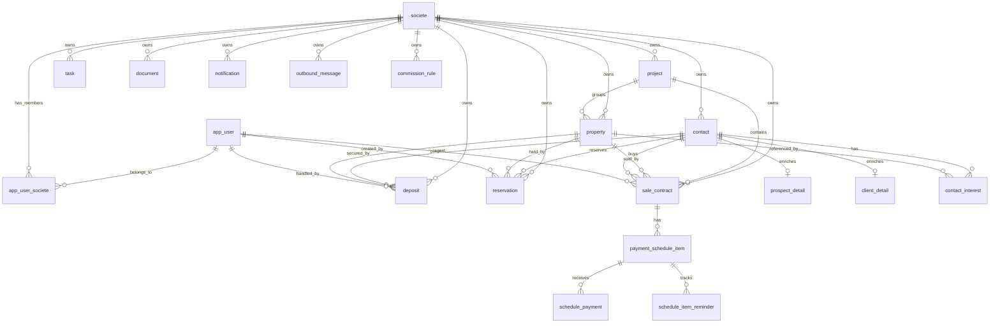

# Data Model

This document reconstructs the current domain model from JPA entities and Liquibase changesets.

## Scope Notes

- The current business schema is company-centric and uses `societe_id`.
- Liquibase history still contains early `tenant`-era migrations used to evolve existing installs.
- The backend code should be treated as the authoritative view of active fields and relationships.

## Core Entity Graph

## Identity and Access

### `app_user`

Global platform user identity.

Key fields inferred from code:

- `id`
- `email`
- `password_hash`
- `enabled`
- `platform_role`
- `token_version`
- `failed_login_attempts`
- `locked_until`
- invitation and profile fields such as `prenom`, `nom_famille`, `telephone`, `poste`, `langue_interface`
- GDPR-related fields such as CGU consent and anonymization state
- `version` for optimistic locking

Behavioral notes:

- Auth lookup uses `findFirstByEmail(...)` for compatibility with pre-dedup data, but the model now expects global email uniqueness.
- Disabling a user or changing role increments `token_version`.

### `societe`

Company record managed by `SUPER_ADMIN`.

Key fields:

- identity and legal metadata: `nom`, `key`, `forme_juridique`, `siret_ice`, `rc`, `if_number`
- location and branding: addresses, phones, `logo_url`, colors, language, currency
- compliance data: DPO fields, declaration numbers, legal basis, retention settings
- licensing data: approval numbers, expiration dates, activity type
- subscription and quota data: `plan_abonnement`, `max_utilisateurs`, `max_biens`, `max_contacts`, `max_projets`
- lifecycle fields: `actif`, suspension timestamps and reasons
- `version` for optimistic locking

### `app_user_societe`

Join table between users and companies.

Key characteristics:

- composite primary key `(user_id, societe_id)`
- `role` constrained to `ADMIN`, `MANAGER`, or `AGENT`
- `actif` soft-removal flag
- audit fields such as add/remove timestamps and actor IDs

This table is the source of company-scoped authorization.

## CRM Master Data

### `project`

Represents a real-estate program or development.

Key rules:

- `name` is unique per societe
- status is `ACTIVE` or `ARCHIVED`
- archived projects remain referentially intact and are not hard-deleted

### `property`

Represents an inventory unit.

Key fields:

- `type`, `status`, `reference_code`, `title`, `price`, `currency`
- address and descriptive fields
- type-specific attributes such as surfaces, bedrooms, floors, zoning, servicing
- `project_id`
- lifecycle timestamps: `published_at`, `reserved_at`, `sold_at`, `deleted_at`
- `version`

Key constraints and behaviors:

- `reference_code` is unique per societe
- the service validates required fields by `PropertyType`
- deletion is soft deletion
- RLS is enabled on this table

### `contact`

Unified contact record for prospects and clients.

Key fields:

- `contact_type`
- `status`
- qualification fields such as `qualified` and `temp_client_until`
- identity and communication fields
- GDPR fields: consent flags, dates, processing basis, retention days, `anonymized_at`
- `version`

Key rules:

- service prevents duplicate email inside the same societe
- RLS is enabled on this table
- a new contact always gets a `ProspectDetail` row through the current service implementation

### `prospect_detail`

One-to-one extension for prospect enrichment:

- `budget_min`
- `budget_max`
- `source`
- `notes`

### `client_detail`

One-to-one extension for client identity:

- `client_kind`
- `company_name`
- `ice`
- `siret`

### `contact_interest`

Bridge between contacts and properties.

Key rule:

- uniqueness on `(societe_id, contact_id, property_id)` is enforced by the current model and service logic

## Commercial Workflow Entities

### `reservation`

Short-lived property hold before deposit.

Key fields:

- `contact_id`
- `property_id`
- `reserved_by_user_id`
- `reservation_price`
- `reservation_date`
- `expiry_date`
- `status`
- `converted_deposit_id`

### `deposit`

Financial commitment against a property.

Key fields:

- `contact_id`
- `property_id`
- `agent_id`
- `amount`, `currency`
- `deposit_date`, `due_date`
- `reference`
- `status`
- `confirmed_at`, `cancelled_at`

Key invariants enforced by service logic:

- property must be `ACTIVE`
- property-level conflicts are guarded with row locking
- duplicate active holds are blocked

### `sale_contract`

Sales agreement tied to project, property, buyer, and agent.

Key fields:

- `project_id`
- `property_id`
- `buyer_contact_id`
- `agent_id`
- `status`
- `agreed_price`
- `list_price`
- `source_deposit_id`
- buyer snapshot fields captured at signing time
- `signed_at`, `canceled_at`
- `version`

Important constraint:

- a partial unique index prevents more than one active signed contract per property

### `commission_rule`

Commission configuration at societe or project scope.

Key fields:

- optional `project_id`
- percentage and/or fixed amount settings

Behavior:

- project-specific rules override societe-wide defaults

### `commercial_audit_event`

Append-only audit table for business workflow events.

## Finance and Collections

### `payment_schedule_item`

Installment or call-for-funds row tied to a contract.

Key fields:

- `contract_id`
- denormalized `project_id` and `property_id`
- `sequence`
- `label`
- `amount`
- `due_date`
- `status`
- `issued_at`, `sent_at`, `canceled_at`

### `schedule_payment`

Recorded payment against a schedule item.

Key fields:

- `schedule_item_id`
- `amount_paid`
- `paid_at`
- `channel`
- `payment_reference`

### `schedule_item_reminder`

Idempotency guard for reminder sends.

## Communication, Files, and Tasks

### `notification`

In-app bell notification addressed to a CRM user.

Key fields:

- `recipient_user_id`
- `type`
- `reference_id`
- `payload`
- `read`

### `outbound_message`

Transactional outbox row for email or SMS.

Key fields:

- `channel`
- `status`
- `recipient`
- `subject`
- `body`
- retry counters and `next_retry_at`

### `document`

Generic attachment linked to a business entity.

Key fields:

- `entity_type`
- `entity_id`
- file metadata
- `uploaded_by`

### `property_media`

Property-specific media record.

### `task`

Follow-up item optionally linked to a contact or property.

Key fields:

- `assignee_id`
- `contact_id`
- `property_id`
- `title`
- `description`
- `due_date`
- `status`

## Portal

### `portal_token`

One-time magic-link token store.

Key implementation details:

- only the token hash is stored
- token has expiry and used-state fields
- portal JWT is generated only after successful one-time verification

## High-Value Constraints

The following constraints materially shape the system:

| Area | Evidence in code |
| --- | --- |
| Membership uniqueness | `app_user_societe` composite primary key |
| Project uniqueness | unique project name per societe |
| Property identity | unique property reference per societe |
| One signed contract per property | partial unique index on signed contract rows |
| Optimistic concurrency | `@Version` on mutable entities such as `User`, `Societe`, `Property`, `Contact`, `SaleContract` |
| RLS coverage | currently only `contact` and `property` |

## Gaps and Clarifications

The schema contains fields whose enforcement is not equally visible in the service layer:

- `max_utilisateurs` is enforced when adding members to a societe.
- `max_biens`, `max_contacts`, and `max_projets` exist in the model, but no matching enforcement was found in the current property, contact, or project services.
- societe suspension fields exist, but no request-time blocking of suspended societes was found in the current auth or domain service flow.
