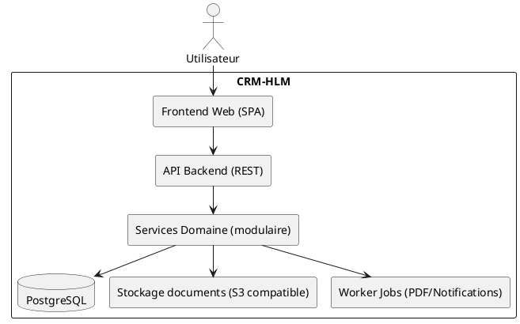

# CRM-HLM — Spécification Technique

**Projet :** CRM-HLM (CRM Promotion & Construction)

**Version :** 1.0-draft

**Date :** 16 février 2026

**Auteur :** Senior Software Architect & Project Director


---

## Table des matières

- 1. Vue d’ensemble d’architecture

- 2. Stack technique & standards

- 3. Modèle de données

- 4. Workflows domaine (techniques)

- 5. Spécification API

- 6. Sécurité

- 7. Architecture Frontend

- 8. Stratégie de tests

- 9. Déploiement & runbook local

- 10. Observabilité

- 11. Risques, dette technique, recommandations

- 12. Roadmap (vue engineering)

- 13. Points ouverts & décisions attendues

- 14. Glossaire

- 15. Sources

- 16. Matrice de traçabilité


---

## 1. Vue d’ensemble d’architecture

Les sources décrivent une solution **SaaS cloud** sécurisée, accessible multi-support, structurée en couches (Frontend Web → API Backend → logique métier → base de données). [SRC: CDC_Premium_Final_Styled_WITH_PRO_DIAGRAMS (1).docx | L18–L19] [SRC: architecture_technique_real.png | L1]


### 1.1 Diagrammes (proposition d’implémentation)

> [OPEN POINT] Les documents ne fixent pas la stack (framework/DB/infra). Le schéma ci-dessous est une proposition cohérente avec les exigences.




Justification : génération PDF (réservations) et notifications (alertes, relances) impliquent des traitements asynchrones. [SRC: CDC_Premium_Final_Styled_WITH_PRO_DIAGRAMS (1).docx | L490–L503] [SRC: CDC_Premium_Final_Styled_WITH_PRO_DIAGRAMS (1).docx | L56–L59] [SRC: CDC_Premium_Final_Styled_WITH_PRO_DIAGRAMS (1).docx | L400–L402]


## 2. Stack technique & standards

### 2.1 Contraintes issues des sources

- SaaS cloud, accessible depuis tout support. [SRC: CDC_Premium_Final_Styled_WITH_PRO_DIAGRAMS (1).docx | L18–L19]
- Sécurité, chiffrement, sauvegardes, audits, RGPD. [SRC: CDC_Premium_Final_Styled_WITH_PRO_DIAGRAMS (1).docx | L643–L647]
- API envisagée (gestion projets, CRUD prospects, intégrations externes). [SRC: CDC_Premium_Final_Styled_WITH_PRO_DIAGRAMS (1).docx | L451–L456] [SRC: CDC_Premium_Final_Styled_WITH_PRO_DIAGRAMS (1).docx | L470–L475] [SRC: CDC_Premium_Final_Styled_WITH_PRO_DIAGRAMS (1).docx | L420–L423]


### 2.2 Choix de stack (à décider)

[OPEN POINT] Les documents ne prescrivent pas de technologies. Options compatibles :
- Option A : **Angular** (frontend) + **NestJS** (API TypeScript) + **PostgreSQL**.
- Option B : **React** (frontend) + **NestJS** (API TypeScript) + **PostgreSQL**.
- Option C : **Django / DRF** (API Python) + SPA (Angular/React) + PostgreSQL.
- **Recommandé : Option A** pour un CRM enterprise (structure, conventions, RBAC), avec un **monolithe modulaire** en MVP.

Versions de référence (info externe, pour cadrer l’exécution) : Node.js v24 (Active LTS), PostgreSQL 18 (dernier majeur). [SRC: nodejs.org/en/about/previous-releases | consulté 16/02/2026] [SRC: postgresql.org | releases (PostgreSQL 18) | consulté 16/02/2026]


### 2.3 Standards (recommandés)

- API : versionnement (`/api/v1`), pagination, filtres par société/projet, idempotency sur opérations sensibles. [OPEN POINT]
- Données : horodatage (`created_at`, `updated_at`), audit log. [SRC: CDC_Premium_Final_Styled_WITH_PRO_DIAGRAMS (1).docx | L643–L647]


## 3. Modèle de données

### 3.1 Principes
- Multi-sociétés/multi-projets : la majorité des entités portent un `societe_id` et/ou `projet_id` pour filtrage et consolidation. [SRC: CDC_Premium_Final_Styled_WITH_PRO_DIAGRAMS (1).docx | L25–L28]
- Archivage documentaire : plusieurs modules joignent des documents (titres fonciers, autorisations, contrats, docs légaux…). [SRC: CDC_Premium_Final_Styled_WITH_PRO_DIAGRAMS (1).docx | L30] [SRC: CDC_Premium_Final_Styled_WITH_PRO_DIAGRAMS (1).docx | L167–L168] [SRC: CDC_Premium_Final_Styled_WITH_PRO_DIAGRAMS (1).docx | L415]


### 3.2 Entités (logiques) — minimum viable

> **Note :** l’ERD est un support ; la liste ci-dessous est prioritairement dérivée du texte (use cases/backlog), puis validée par l’ERD. [SRC: erd_detail_pro2.png | L1]


| Domaine | Entité / Table (proposée) | Description | Clés/contraintes (proposées) | Sources |
| --- | --- | --- | --- | --- |
| Sécurité | users, roles, permissions, user_role_scope | RBAC + périmètres société/projet/module. | PK id; unicité email; tables de jointure | [SRC: CDC_Premium_Final_Styled_WITH_PRO_DIAGRAMS (1).docx \| L68–L84] [SRC: CDC_Premium_Final_Styled_WITH_PRO_DIAGRAMS (1).docx \| L359] |
| Organisation | societes, projets | Sociétés + projets ; consolidation direction. | projets.societe_id FK | [SRC: CDC_Premium_Final_Styled_WITH_PRO_DIAGRAMS (1).docx \| L25–L28] |
| Commercial | prospects, lots, reservations, documents | Prospects, lots, réservations + documents générés. | lots.projet_id FK; reservation.lot_id unique (si 1 active) [OPEN POINT] | [SRC: CDC_Premium_Final_Styled_WITH_PRO_DIAGRAMS (1).docx \| L34–L38] [SRC: CDC_Premium_Final_Styled_WITH_PRO_DIAGRAMS (1).docx \| L490–L503] |
| Foncier | terrains, terrain_documents, terrain_pipeline_events | Fiches terrains + pièces + pipeline + COS/CES. | terrains.societe_id FK; champs surface/cos/ces [OPEN POINT] | [SRC: CDC_Premium_Final_Styled_WITH_PRO_DIAGRAMS (1).docx \| L29–L32] [SRC: CDC_Premium_Final_Styled_WITH_PRO_DIAGRAMS (1).docx \| L104–L107] |
| Administratif | autorisations, autorisation_etapes, autorisation_documents, alerts | Autorisations + étapes + documents + alertes. | etapes.ordre int; alerts.due_date | [SRC: CDC_Premium_Final_Styled_WITH_PRO_DIAGRAMS (1).docx \| L56–L59] [SRC: CDC_Premium_Final_Styled_WITH_PRO_DIAGRAMS (1).docx \| L169–L172] |
| Chantier | chantiers, phases_chantier, journal_chantier, chantier_photos, incidents | Suivi Gantt/phasage + journal + photos/incidents. | FK projet_id; phases dates | [SRC: CDC_Premium_Final_Styled_WITH_PRO_DIAGRAMS (1).docx \| L39–L44] [SRC: CDC_Premium_Final_Styled_WITH_PRO_DIAGRAMS (1).docx \| L135–L138] |
| Stocks | articles, stock_mouvements, inventaires | Matériaux, mouvements, inventaires ; QR/NFC. | mouvements.quantite; article.code unique [OPEN POINT] | [SRC: CDC_Premium_Final_Styled_WITH_PRO_DIAGRAMS (1).docx \| L45–L49] [SRC: CDC_Premium_Final_Styled_WITH_PRO_DIAGRAMS (1).docx \| L145–L147] |
| Achats | demandes_achat, bons_commande, bons_livraison, factures_fournisseur, fournisseurs, achats_lignes | DA/BC/BL/Facture + fournisseurs. | FK projet_id; rapprochement référentiel [OPEN POINT] | [SRC: CDC_Premium_Final_Styled_WITH_PRO_DIAGRAMS (1).docx \| L150–L162] [SRC: CDC_Premium_Final_Styled_WITH_PRO_DIAGRAMS (1).docx \| L55] |
| Finance | depenses, budgets, encaissements, ecritures_financieres | Coûts, marges, export comptable. | depenses.projet_id; écritures journal [OPEN POINT] | [SRC: CDC_Premium_Final_Styled_WITH_PRO_DIAGRAMS (1).docx \| L59–L64] [SRC: CDC_Premium_Final_Styled_WITH_PRO_DIAGRAMS (1).docx \| L179–L182] |
| SAV | tickets_sav, interventions_sav, sav_events | Tickets + interventions + workflow. | ticket.status ; intervention.assignee_user_id | [SRC: CDC_Premium_Final_Styled_WITH_PRO_DIAGRAMS (1).docx \| L184–L192] [SRC: CDC_Premium_Final_Styled_WITH_PRO_DIAGRAMS (1).docx \| L189–L192] |
| Sous-traitance | sous_traitants, sous_traitant_documents, sous_traitant_notes | Docs légaux + notation/historique. | docs obligatoires [OPEN POINT] | [SRC: CDC_Premium_Final_Styled_WITH_PRO_DIAGRAMS (1).docx \| L414–L416] |


### 3.3 Index & performances (recommandations)

- Index composés typiques : `(societe_id, projet_id)`, `(projet_id, status)`, `(societe_id, created_at)`. [OPEN POINT]
- Recherche : prospects (nom/tel/email), lots (référence), fournisseurs (nom). [SRC: CDC_Premium_Final_Styled_WITH_PRO_DIAGRAMS (1).docx | L34–L36] [SRC: CDC_Premium_Final_Styled_WITH_PRO_DIAGRAMS (1).docx | L54–L55]


## 4. Workflows domaine (techniques)

### 4.1 Table des workflows (front→API→DB)

| WF-Tech | Opération | Transaction DB | Idempotency | Side effects | Sources |
| --- | --- | --- | --- | --- | --- |
| T-001 | Créer réservation | Oui (verrou lot) [OPEN POINT] | Idempotency-Key [OPEN POINT] | Générer PDF (async), MAJ KPIs | [SRC: CDC_Premium_Final_Styled_WITH_PRO_DIAGRAMS (1).docx \| L368] [SRC: CDC_Premium_Final_Styled_WITH_PRO_DIAGRAMS (1).docx \| L490–L503] |
| T-002 | Valider étape autorisation | Oui | N/A | Créer/MAJ alertes, notifier direction | [SRC: CDC_Premium_Final_Styled_WITH_PRO_DIAGRAMS (1).docx \| L169–L172] [SRC: CDC_Premium_Final_Styled_WITH_PRO_DIAGRAMS (1).docx \| L168] |
| T-003 | Créer DA puis BC | Oui | N/A | Rapprochement BC/BL/Facture (état) | [SRC: CDC_Premium_Final_Styled_WITH_PRO_DIAGRAMS (1).docx \| L159–L162] |
| T-004 | Entrée stock (scan QR) | Oui | Idempotency sur scan [OPEN POINT] | Notifier chantier | [SRC: CDC_Premium_Final_Styled_WITH_PRO_DIAGRAMS (1).docx \| L145–L147] |
| T-005 | Clôturer ticket SAV | Oui | N/A | MAJ historique, indicateurs | [SRC: CDC_Premium_Final_Styled_WITH_PRO_DIAGRAMS (1).docx \| L189–L192] |


### 4.2 Cohérence achats (rapprochement)

Le rapprochement BC/BL/Facture est explicitement mentionné. Implémentation recommandée : états de rapprochement + liens documentaires. [SRC: CDC_Premium_Final_Styled_WITH_PRO_DIAGRAMS (1).docx | L55] [SRC: CDC_Premium_Final_Styled_WITH_PRO_DIAGRAMS (1).docx | L398]


## 5. Spécification API

### 5.1 Principes

Le CDC mentionne explicitement la présence d’API pour certains modules (ex : gestion des projets, CRUD prospects) et des intégrations externes. [SRC: CDC_Premium_Final_Styled_WITH_PRO_DIAGRAMS (1).docx | L451–L456] [SRC: CDC_Premium_Final_Styled_WITH_PRO_DIAGRAMS (1).docx | L470–L475] [SRC: CDC_Premium_Final_Styled_WITH_PRO_DIAGRAMS (1).docx | L420–L423]


### 5.2 Table des endpoints (proposée)

> [OPEN POINT] Les routes exactes ne sont pas définies dans les sources ; table ci-dessous = contrat recommandé pour implémenter les modules cités.


| Endpoint | Méthode | Description | Auth/Rôle | Sources |
| --- | --- | --- | --- | --- |
| /api/v1/auth/login | POST | Authentification (session/JWT) | Public | [SRC: CDC_Premium_Final_Styled_WITH_PRO_DIAGRAMS (1).docx \| L643–L647] |
| /api/v1/users | GET/POST | Lister/créer utilisateurs | Admin | [SRC: CDC_Premium_Final_Styled_WITH_PRO_DIAGRAMS (1).docx \| L68–L84] |
| /api/v1/users/{id} | GET/PATCH/DELETE | Détail/MAJ/désactivation utilisateur | Admin | [SRC: CDC_Premium_Final_Styled_WITH_PRO_DIAGRAMS (1).docx \| L68–L84] |
| /api/v1/societes | GET/POST | Lister/créer sociétés | Admin | [SRC: CDC_Premium_Final_Styled_WITH_PRO_DIAGRAMS (1).docx \| L25–L28] |
| /api/v1/projets | GET/POST | Lister/créer projets | Admin | [SRC: CDC_Premium_Final_Styled_WITH_PRO_DIAGRAMS (1).docx \| L451–L456] |
| /api/v1/prospects | GET/POST | CRUD prospects (base du commercial) | Commercial | [SRC: CDC_Premium_Final_Styled_WITH_PRO_DIAGRAMS (1).docx \| L470–L475] |
| /api/v1/lots | GET/POST | CRUD lots + filtres dispo/prix | Commercial | [SRC: CDC_Premium_Final_Styled_WITH_PRO_DIAGRAMS (1).docx \| L35–L36] |
| /api/v1/reservations | POST | Créer réservation (verrou lot) | Commercial | [SRC: CDC_Premium_Final_Styled_WITH_PRO_DIAGRAMS (1).docx \| L368] |
| /api/v1/reservations/{id}/documents | POST | Générer PDF (réservation/contrat) | Commercial | [SRC: CDC_Premium_Final_Styled_WITH_PRO_DIAGRAMS (1).docx \| L490–L503] |
| /api/v1/terrains | GET/POST | CRUD terrains + pipeline | Foncier | [SRC: CDC_Premium_Final_Styled_WITH_PRO_DIAGRAMS (1).docx \| L509–L518] |
| /api/v1/autorisations | GET/POST | Suivi autorisations (étapes, docs, alertes) | Admin/Direction | [SRC: CDC_Premium_Final_Styled_WITH_PRO_DIAGRAMS (1).docx \| L375–L379] |
| /api/v1/demandes-achat | GET/POST | Créer/lister demandes d’achat | Achats | [SRC: CDC_Premium_Final_Styled_WITH_PRO_DIAGRAMS (1).docx \| L151–L154] |
| /api/v1/bons-commande | GET/POST | BC + lignes | Achats | [SRC: CDC_Premium_Final_Styled_WITH_PRO_DIAGRAMS (1).docx \| L157–L161] |
| /api/v1/stocks/mouvements | POST | Entrée/sortie stock (scan QR) | Stock | [SRC: CDC_Premium_Final_Styled_WITH_PRO_DIAGRAMS (1).docx \| L141–L147] |
| /api/v1/tickets-sav | GET/POST | Créer/lister tickets SAV | SAV | [SRC: CDC_Premium_Final_Styled_WITH_PRO_DIAGRAMS (1).docx \| L184–L192] |


### 5.3 Exemples de payloads (minimaux)

```json
{
  "reservation": {
    "lot_id": "...",
    "prospect_id": "...",
    "date": "2026-02-16",
    "societe_id": "...",
    "projet_id": "..."
  }
}
```

> [OPEN POINT] Les champs exacts ne sont pas précisés dans les sources ; l’exemple illustre le rattachement société/projet. [SRC: CDC_Premium_Final_Styled_WITH_PRO_DIAGRAMS (1).docx | L25–L28]


## 6. Sécurité

### 6.1 Exigences issues des sources
- Authentification forte + chiffrement. [SRC: CDC_Premium_Final_Styled_WITH_PRO_DIAGRAMS (1).docx | L643–L647]
- Sauvegardes automatiques. [SRC: CDC_Premium_Final_Styled_WITH_PRO_DIAGRAMS (1).docx | L643–L647]
- Traçabilité/audits. [SRC: CDC_Premium_Final_Styled_WITH_PRO_DIAGRAMS (1).docx | L643–L647]
- Conformité RGPD (Maroc + UE). [SRC: CDC_Premium_Final_Styled_WITH_PRO_DIAGRAMS (1).docx | L21–L22] [SRC: CDC_Premium_Final_Styled_WITH_PRO_DIAGRAMS (1).docx | L643–L647]


### 6.2 Table des permissions (technique)

> [OPEN POINT] Les permissions détaillées par action ne sont pas listées dans les sources ; table = modèle d’exécution recommandé.


| Rôle | Scope | Exemples d’autorisations API | Sources |
| --- | --- | --- | --- |
| Admin | global | users.*, societes.*, projets.*, paramétrage pipelines | [SRC: CDC_Premium_Final_Styled_WITH_PRO_DIAGRAMS (1).docx \| L68–L84] [SRC: CDC_Premium_Final_Styled_WITH_PRO_DIAGRAMS (1).docx \| L359] |
| Direction | societe/projet | read dashboards, valider foncier/autorisations | [SRC: CDC_Premium_Final_Styled_WITH_PRO_DIAGRAMS (1).docx \| L200–L204] [SRC: CDC_Premium_Final_Styled_WITH_PRO_DIAGRAMS (1).docx \| L380–L383] |
| Commercial | societe/projet | prospects.*, lots.*, reservations.create, documents.generate | [SRC: CDC_Premium_Final_Styled_WITH_PRO_DIAGRAMS (1).docx \| L364–L369] [SRC: CDC_Premium_Final_Styled_WITH_PRO_DIAGRAMS (1).docx \| L490–L503] |
| Foncier | societe | terrains.*, foncier.pipeline.transition | [SRC: CDC_Premium_Final_Styled_WITH_PRO_DIAGRAMS (1).docx \| L370–L374] [SRC: CDC_Premium_Final_Styled_WITH_PRO_DIAGRAMS (1).docx \| L104–L107] |
| Technique/Chantier | projet | chantiers.*, journal.*, photos.upload | [SRC: CDC_Premium_Final_Styled_WITH_PRO_DIAGRAMS (1).docx \| L125–L134] [SRC: CDC_Premium_Final_Styled_WITH_PRO_DIAGRAMS (1).docx \| L135–L138] |
| Achats | projet | demandes_achat.*, bons_commande.*, factures_fournisseur.* | [SRC: CDC_Premium_Final_Styled_WITH_PRO_DIAGRAMS (1).docx \| L150–L162] |
| Stock | projet | stocks.mouvements.create, inventaires.* | [SRC: CDC_Premium_Final_Styled_WITH_PRO_DIAGRAMS (1).docx \| L45–L49] [SRC: CDC_Premium_Final_Styled_WITH_PRO_DIAGRAMS (1).docx \| L145–L147] |
| Finance | societe/projet | depenses.*, marges.read, exports.create | [SRC: CDC_Premium_Final_Styled_WITH_PRO_DIAGRAMS (1).docx \| L406–L409] |
| SAV | projet | tickets_sav.*, interventions.* | [SRC: CDC_Premium_Final_Styled_WITH_PRO_DIAGRAMS (1).docx \| L184–L192] |


### 6.3 CORS, JWT/OIDC, SSO

[OPEN POINT] Le CDC mentionne SSO « si applicable » lors de la configuration cloud/sécurité. [SRC: CDC_Premium_Final_Styled_WITH_PRO_DIAGRAMS (1).docx | L436]
- Option A : JWT interne (simple MVP).
- Option B : OIDC (Keycloak/Entra/Okta) + JWT signé.
- **Recommandé : Option B** si multi-sociétés nécessite gouvernance entreprise.


## 7. Architecture Frontend

Les sources citent des interfaces pour création/édition et une amélioration UI/UX, sans préciser framework. [SRC: CDC_Premium_Final_Styled_WITH_PRO_DIAGRAMS (1).docx | L456] [SRC: CDC_Premium_Final_Styled_WITH_PRO_DIAGRAMS (1).docx | L495]


### 7.1 Pages minimales (MVP)

| Route/Page (proposée) | Objectif | Sources |
| --- | --- | --- |
| /login | Connexion | [SRC: CDC_Premium_Final_Styled_WITH_PRO_DIAGRAMS (1).docx \| L643–L647] |
| /admin/users | Gestion utilisateurs/roles | [SRC: CDC_Premium_Final_Styled_WITH_PRO_DIAGRAMS (1).docx \| L68–L84] |
| /admin/societes | Gestion sociétés | [SRC: CDC_Premium_Final_Styled_WITH_PRO_DIAGRAMS (1).docx \| L25–L28] |
| /admin/projets | Gestion projets | [SRC: CDC_Premium_Final_Styled_WITH_PRO_DIAGRAMS (1).docx \| L451–L456] |
| /crm/prospects | Liste + fiche prospect | [SRC: CDC_Premium_Final_Styled_WITH_PRO_DIAGRAMS (1).docx \| L470–L475] |
| /crm/lots | Catalogue lots + filtres | [SRC: CDC_Premium_Final_Styled_WITH_PRO_DIAGRAMS (1).docx \| L474–L475] |
| /crm/reservations | Créer/consulter réservations + docs | [SRC: CDC_Premium_Final_Styled_WITH_PRO_DIAGRAMS (1).docx \| L490–L503] |
| /foncier/terrains | Fiches terrains + pipeline | [SRC: CDC_Premium_Final_Styled_WITH_PRO_DIAGRAMS (1).docx \| L509–L518] |
| /admin/autorisations | Workflow administratif + docs/alertes | [SRC: CDC_Premium_Final_Styled_WITH_PRO_DIAGRAMS (1).docx \| L529–L533] |
| /dashboards | KPIs commercial + synthèse direction | [SRC: CDC_Premium_Final_Styled_WITH_PRO_DIAGRAMS (1).docx \| L498–L502] |


### 7.2 Scanning QR/NFC

[OPEN POINT] Les sources demandent QR/NFC pour les stocks, sans préciser le dispositif (web mobile, app, lecteur). [SRC: CDC_Premium_Final_Styled_WITH_PRO_DIAGRAMS (1).docx | L45–L47]
- Option A : Web mobile (PWA) + scan caméra QR.
- Option B : App mobile dédiée + NFC.
- **Recommandé : Option A** pour MVP (coût réduit), Option B si NFC impératif.


## 8. Stratégie de tests

Le plan de sprint inclut des scénarios de tests par incrément (auth, rôles, réservations, KPI…). [SRC: CDC_Premium_Final_Styled_WITH_PRO_DIAGRAMS (1).docx | L441–L444] [SRC: CDC_Premium_Final_Styled_WITH_PRO_DIAGRAMS (1).docx | L499–L502]

| Niveau | Cible | Exemples de scénarios prioritaires | Sources |
| --- | --- | --- | --- |
| Unit | Services domaine | Validation transitions pipeline, contrôles RBAC | [SRC: CDC_Premium_Final_Styled_WITH_PRO_DIAGRAMS (1).docx \| L120–L123] [SRC: CDC_Premium_Final_Styled_WITH_PRO_DIAGRAMS (1).docx \| L643–L647] |
| Intégration | API + DB | Création réservation (anti-double) ; rapprochement BC/BL/facture ; alertes autorisations | [SRC: CDC_Premium_Final_Styled_WITH_PRO_DIAGRAMS (1).docx \| L368] [SRC: CDC_Premium_Final_Styled_WITH_PRO_DIAGRAMS (1).docx \| L55] [SRC: CDC_Premium_Final_Styled_WITH_PRO_DIAGRAMS (1).docx \| L375–L378] |
| E2E | Frontend | Prospect→réservation→PDF ; terrain→COS/CES ; lecture KPIs | [SRC: CDC_Premium_Final_Styled_WITH_PRO_DIAGRAMS (1).docx \| L490–L503] [SRC: CDC_Premium_Final_Styled_WITH_PRO_DIAGRAMS (1).docx \| L509–L518] [SRC: CDC_Premium_Final_Styled_WITH_PRO_DIAGRAMS (1).docx \| L498–L502] |


## 9. Déploiement & runbook local

[OPEN POINT] Aucune contrainte infra détaillée n’est fournie ; le CDC exige la mise en place d’environnements dev/staging/prod. [SRC: CDC_Premium_Final_Styled_WITH_PRO_DIAGRAMS (1).docx | L435]
- Recommandation : Docker Compose pour dev ; CI/CD vers staging/prod ; secrets manager (cloud). [OPEN POINT]


## 10. Observabilité

[OPEN POINT] Les sources exigent traçabilité/audit mais ne spécifient pas logs/metrics/traces. [SRC: CDC_Premium_Final_Styled_WITH_PRO_DIAGRAMS (1).docx | L643–L647]
- Recommandation : logs structurés + métriques (latence API, erreurs) + traces (si besoin). [OPEN POINT]


## 11. Risques, dette technique, recommandations

- **Ambiguïtés de domaine** : listes de statuts/transitions non figées (lots, prospects, SAV). [OPEN POINT] [SRC: CDC_Premium_Final_Styled_WITH_PRO_DIAGRAMS (1).docx | L120–L123] [SRC: CDC_Premium_Final_Styled_WITH_PRO_DIAGRAMS (1).docx | L189–L192]
- **Intégrations** : comptabilité/site/outils partenaires non spécifiés (risque planning). [OPEN POINT] [SRC: CDC_Premium_Final_Styled_WITH_PRO_DIAGRAMS (1).docx | L420–L423]
- **QR/NFC** : dépend des devices/process chantier ; valider tôt. [OPEN POINT] [SRC: CDC_Premium_Final_Styled_WITH_PRO_DIAGRAMS (1).docx | L45–L47]


## 12. Roadmap (vue engineering)

Les sprints décrivent un séquencement implémentable ; ci-dessous une traduction engineering (MVP puis extensions). [SRC: CDC_Premium_Final_Styled_WITH_PRO_DIAGRAMS (1).docx | L425–L639]


| Phase | Contenu engineering | Dépendances | Sources |
| --- | --- | --- | --- |
| MVP | Auth/RBAC + multi-sociétés/projets + CRM (prospects/lots/pipeline) + réservations/PDF + foncier/COS-CES + administratif + dashboards | PostgreSQL + stockage docs + worker jobs | [SRC: CDC_Premium_Final_Styled_WITH_PRO_DIAGRAMS (1).docx \| L350–L383] [SRC: CDC_Premium_Final_Styled_WITH_PRO_DIAGRAMS (1).docx \| L490–L518] |
| V2 | Chantier + stocks + achats | Devices scan QR ; modèles achats/stock | [SRC: CDC_Premium_Final_Styled_WITH_PRO_DIAGRAMS (1).docx \| L635–L639] |
| V3 | Finance complet + qualité/sécurité chantier + sous-traitants + SAV + intégrations | Spécifications exports & connecteurs | [SRC: CDC_Premium_Final_Styled_WITH_PRO_DIAGRAMS (1).docx \| L404–L423] |


## 13. Points ouverts & décisions attendues

### 13.1 Stack (frontend/backend/DB/infra)

[OPEN POINT] La stack n’est pas prescrite ; décision nécessaire pour démarrer l’implémentation. [SRC: architecture_technique_real.png | L1]
- Option A : Angular + NestJS + PostgreSQL (recommandé).
- Option B : React + NestJS + PostgreSQL.
- Option C : Django/DRF + PostgreSQL.


### 13.2 Schéma DB détaillé & contraintes

[OPEN POINT] L’ERD fournit des groupes d’entités mais pas toutes les colonnes/contraintes ; à finaliser en atelier data. [SRC: erd_detail_pro2.png | L1]
- Option A : schéma minimal MVP (tables listées §3.2) puis extensions.
- Option B : schéma complet V1 (plus long, plus risqué).
- **Recommandé : Option A**.


### 13.3 Contrat d’intégration comptable

[OPEN POINT] « Export comptable / intégrations comptabilité » est mentionné sans format (CSV, EDI, API). [SRC: CDC_Premium_Final_Styled_WITH_PRO_DIAGRAMS (1).docx | L63] [SRC: CDC_Premium_Final_Styled_WITH_PRO_DIAGRAMS (1).docx | L420–L421]
- Option A : export CSV paramétrable.
- Option B : API bidirectionnelle + webhooks.
- **Recommandé : Option A** pour V1, Option B si besoin temps réel.


## 14. Glossaire

Voir glossaire fonctionnel (mêmes termes). [SRC: CDC_Premium_Final_Styled_WITH_PRO_DIAGRAMS (1).docx | L24–L64]


## 15. Sources

- CDC_Premium_Final_Styled_WITH_PRO_DIAGRAMS (1).docx

- Cahier Des Charges Crm V2.docx

- erd_detail_pro2.png

- uml_usecases_global_pro2.png

- roadmap.png

- architecture_technique_real.png

- bpmn_vente_ultra_pro.png

- bpmn_achat_ultra_pro.png

- bpmn_sav_pro.png

- [Externe] nodejs.org/en/about/previous-releases (versions LTS)

- [Externe] postgresql.org (releases PostgreSQL)


## 16. Matrice de traçabilité (Design/Tech → Source)

| Décision/Artefact | Justification | Sources |
| --- | --- | --- |
| Architecture en couches (SPA→API→DB) | Schéma d’architecture fourni + besoin SaaS cloud | [SRC: architecture_technique_real.png \| L1] [SRC: CDC_Premium_Final_Styled_WITH_PRO_DIAGRAMS (1).docx \| L18–L19] |
| Worker jobs (PDF/notifications) | Génération PDF + alertes/automatisations | [SRC: CDC_Premium_Final_Styled_WITH_PRO_DIAGRAMS (1).docx \| L490–L503] [SRC: CDC_Premium_Final_Styled_WITH_PRO_DIAGRAMS (1).docx \| L56–L59] [SRC: CDC_Premium_Final_Styled_WITH_PRO_DIAGRAMS (1).docx \| L400–L402] |
| Tenancy `societe_id`/`projet_id` | Filtrage & reporting consolidé + permissions par société/projet | [SRC: CDC_Premium_Final_Styled_WITH_PRO_DIAGRAMS (1).docx \| L25–L28] [SRC: CDC_Premium_Final_Styled_WITH_PRO_DIAGRAMS (1).docx \| L359] |
| Endpoints CRUD projets/prospects | Mention d’API projets + CRUD prospects (sprints) | [SRC: CDC_Premium_Final_Styled_WITH_PRO_DIAGRAMS (1).docx \| L451–L456] [SRC: CDC_Premium_Final_Styled_WITH_PRO_DIAGRAMS (1).docx \| L470–L475] |
| Rapprochement BC/BL/Facture | Règle opérationnelle citée | [SRC: CDC_Premium_Final_Styled_WITH_PRO_DIAGRAMS (1).docx \| L55] |
| Sécurité (auth forte, backups, audits, RGPD) | Section conformité & sécurité | [SRC: CDC_Premium_Final_Styled_WITH_PRO_DIAGRAMS (1).docx \| L643–L647] |
| Référence versions runtime/DB | Cadrage exécution (info externe) | [SRC: nodejs.org/en/about/previous-releases \| consulté 16/02/2026] [SRC: postgresql.org \| releases \| consulté 16/02/2026] |
