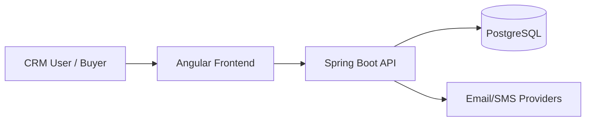
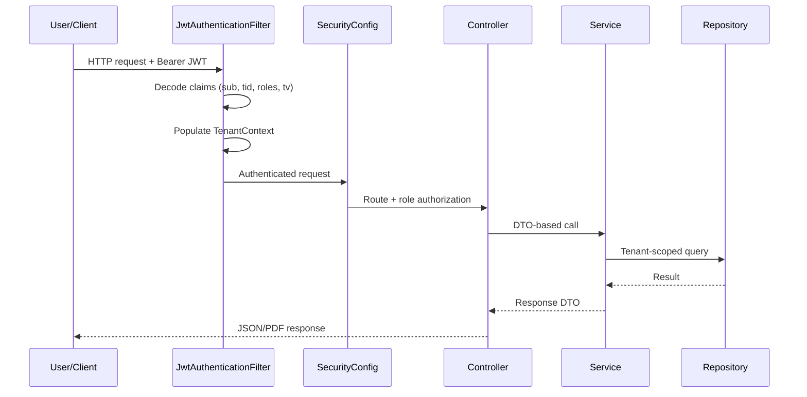

# 00 — Overview v2

## 1. Overview
YEM SaaS Platform is a multi-tenant CRM for real-estate promotion teams, with a client portal for buyers.

Core business outcomes:
- centralize lead-to-sale operations,
- avoid double reservation and double selling,
- improve sales visibility with reliable KPIs,
- provide self-service access for buyers through a secure portal.

## 2. Architecture (High Level)

### Request and security path

## 3. Product Modules and Value
| Module | What It Does | Business Value |
|--------|---------------|----------------|
| Auth & RBAC | Login, role enforcement, token version checks | Secure role-based access and session control |
| Tenant isolation | Per-tenant context and scoped queries | Prevents cross-company data leakage |
| Contacts & prospects | Lead records, statuses, interests, timeline | Structured pipeline follow-up |
| Projects & properties | Inventory lifecycle and project grouping | Commercial stock control |
| Deposits | Reservation workflow and release rules | Prevents overbooking |
| Contracts | Sale lifecycle and legal document generation | Revenue recognition consistency |
| Payments (v2) | Call-for-funds schedule and cash tracking | Better receivables and cash visibility |
| Dashboards | Commercial and receivables analytics | Management decisions based on KPIs |
| Outbox messaging | Async email/SMS composition and dispatch | Reliable communication traceability |
| Portal | Buyer magic-link login and read-only access | Client transparency and trust |

## 4. Key Business Rules
1. Tenant isolation is mandatory and server-enforced.
2. Sale is counted when contract status is `SIGNED`.
3. Deposit is reservation, not final sale.
4. Property commercial transitions must be workflow-consistent (`ACTIVE`, `RESERVED`, `SOLD`).
5. Liquibase schema changes are additive-only.

## 5. Environments and Dependencies
### Runtime dependencies
- Java 21
- PostgreSQL
- Node 18+ / npm 9+ (frontend)

### Dev/test dependencies
- Docker for Testcontainers integration tests
- `jq` for API command-line checks

## 6. Setup and Usage Entry Points
- Developer setup: `docs/05_DEV_GUIDE.md` (v1) and `docs/v2/api-quickstart.v2.md` (v2 quick execution)
- Business context: `docs/v2/business-specification.v2.md`
- API catalog: `docs/v2/api.v2.md`
- v1 retirement execution: `docs/v2/payment-v1-retirement-plan.v2.md`

## 7. Constraints and Known Design Decisions
- `payment/` (v1) endpoints are deprecated; `payments/` (v2) is the preferred path.
- Portal and CRM tokens are isolated by design (`hlm_portal_token` vs `hlm_access_token`).
- PDF generation is synchronous/in-memory; monitor heap sizing in production.

## 8. References
- [v2 Business Spec](business-specification.v2.md)
- [v2 API Catalog](api.v2.md)
- [v2 API Quickstart](api-quickstart.v2.md)
- [Payment v1 Retirement Plan](payment-v1-retirement-plan.v2.md)
- [v2 Onboarding](08_ONBOARDING_COURSE.v2.md)
- [v2 Checklist](09_NEW_ENGINEER_CHECKLIST.v2.md)
